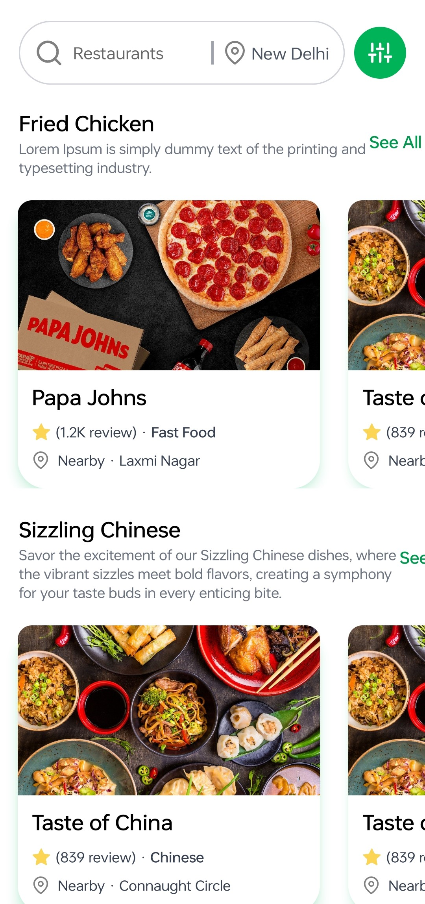
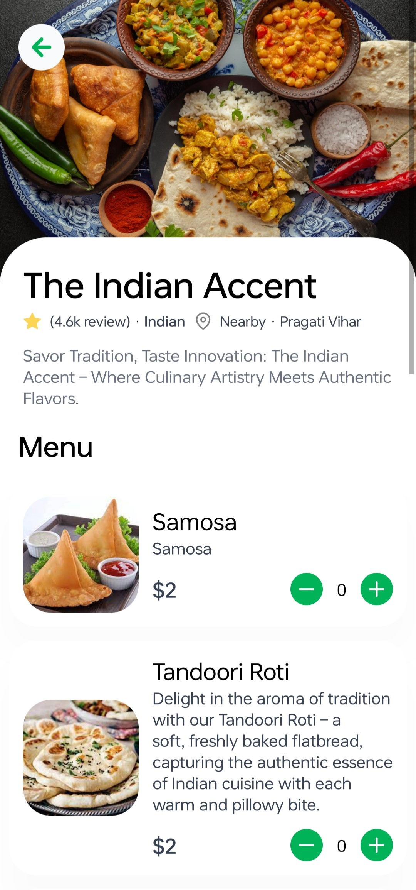

# DishDash

DishDash is a cross-platform food delivery app designed to provide a seamless and efficient user experience. Built using modern web and mobile technologies, DishDash aims to connect users with their favorite restaurants and deliver food to their doorstep with ease.

## Features

- **Cross-Platform Compatibility**: Built with React Native, ensuring the app runs smoothly on both iOS and Android devices.
- **Responsive UI**: Utilizes Tailwind CSS for a clean and responsive design that adapts to different screen sizes.
- **Content Management**: Integrated Sanity CMS for efficient content management and easy updates.
- **Real-Time Updates**: Real-time order tracking and status updates to keep users informed.
- **Restaurant Listings**: Comprehensive restaurant listings with detailed menus, reviews, and ratings.

## Technologies Used

- **JavaScript**: Core programming language used for app development.
- **React Native**: Framework for building cross-platform mobile applications.
- **Tailwind CSS**: Utility-first CSS framework for designing responsive UIs.
- **Sanity CMS**: Headless CMS for efficient content management.

## Screenshots

  
  
  
  
  
  

